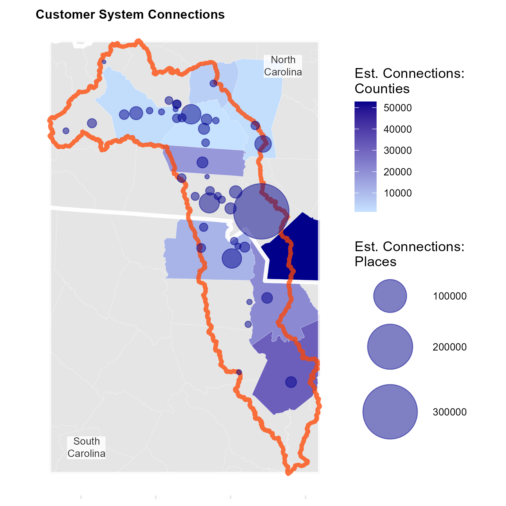

```{r setup, include=FALSE}
knitr::opts_chunk$set(echo = TRUE, warning = FALSE, message = FALSE, fig.height = 8, fig.width = 8)
rm(list = ls())
```

```{r theme, include = FALSE}
theme_catawba <- function(){
  font = "sans"
  theme_minimal() %+replace%
    theme(
      panel.grid.major = element_blank(),
      panel.grid.minor = element_blank(),
      axis.ticks = element_blank(),
      axis.ticks.x.bottom = element_line(
        color = "grey90", 
        size = .5),
      plot.title = element_text(
        family = font,
        size = 18,
        face = 'bold',
        hjust = 0,
        vjust = 0),
      plot.subtitle = element_text(
        family = font,
        size = 8,
        hjust = 0,
        margin = margin(2, b = 10),
        face = "italic"),
      plot.caption = element_text(
        family = font,
        size = 6,
        hjust = 1),
      axis.title = element_text(
        family = font,
        size = 6,
        margin = margin(5, b = 10)),
      axis.text = element_blank(),
      legend.position = "right",
      legend.text = element_text(
        family = font,
        size = 8)
      )
}
```

# Introduction

The Catawba Wateree Watershed (referred to as the Catawba Watershed in this project) is located in North and South Carolina and contains a majority of the greater metropolitan area of Charlotte, NC. [The Water Center at Penn](https://watercenter.sas.upenn.edu/) is working with the [Catawba Wateree Water Management Group](https://www.catawbawatereewmg.org/) (CWWMG) to support development of the group's first integrated water resources plan (IWRP), which will shift emphasis from water supply alone to water supply, demand, quality, and protection. 


\n
Following a scoping process for the plan in 2023, the Water Center was tasked with developing an environmental economic evaluation. As part of this evaluation, the group was interested in a comprehensive look at water infrastructure throughout the watershed, given its foundational importance to the economy and the need for replacing much of it over the next 50 years. Additionally, the Water Center incorporates equity and environmental justice in its work and seeks to implement those perspectives throughout this projects.

This project seeks to identify priority areas for investment through cluster analysis, using data across the watershed that includes the four main categories of water infrastructure - drinking water, wastewater, stormwater, and other (generally in the form of dams) - as well as socioeconomic characteristics and an environmental justice index. Using U.S. census tracts in the watershed to aggregate this data, the goal of the analysis is to characterize areas in the watershed that will likely need long-term investment to keep infrastructure operational but might face economic or environmental challenges in doing so. This work also emphasizes the arbitrary nature of administrative boundaries for a watershed and the need for equitable investment throughout the region given the interconnected nature of the watershed.  

# Background

## Project Background

[CWWMG is comprised of 18 members](https://www.catawbawatereewmg.org/our-mission#our-members) - representatives from 17 public water utilities that operate water intakes in the watershed and a representative from Duke Energy, a major energy provider and operator of hydroelectric power plants in the region. Duke Energy supported the founding of the group after a federal relicensing agreement process for its hydroelectric projects in 2007. CWWMG released a [water supply master plan](https://catawbwa.hdrstratcommtest.com/our-work/water-supply-master-plan) in 2014 that emphasized water resource planning to ensure a sustainable water supply for the region. The group is now developing an [integrated water resources plan](https://www.catawbawatereewmg.org/our-work/water-resources-plan) to release in 2025 that shifts focus from water supply alone to a more holistic and collaborative approach to water management with the following focus areas:

* Communication and education
* Implementation and evaluation mechanisms
* Water quality
* Collaboration and consistency
* Water quantity and availability
* Realistic planning for future growth

The Water Center at Penn joined this engagement through the professional services firm HDR, which was hired by CWWMG to support the full development cycle of the IWRP. Seeking to identify which type of evaluation best suited the group's needs, the Water Center began by conducting a scoping process. This process included stakeholder interviews, a limited literature review and evaluation of existing tools and data, and developing proposals for four potential evaluation methods: 

* A regional economic impact analysis
* Detailed documentation of case studies
* A cost/benefit analysis based on four scenarios for the watershed developed by the consulting firm RTI
* A return on investment study of selected IWRP recommendations

CWWMG ultimately chose to move forward with the return on investment study but asked the Water Center to incorporate a limited number of case studies and an inventory and valuation of water infrastructure. The latter is the primary focus of this research.

## Watershed Background

### Service Area

The Catawba Watershed stretches across 3.6 million acres of North and South Carolina, with 367 river miles, 11 interconnected reservoirs, and 12 hydroelectric power plants. CWWMG's [website](https://www.catawbawatereewmg.org/) states that the Catawba-Wateree River, the namesake of the watershed, is the water source for 2 million people and generates power for 3.7 million homes in the region. The group also highlights that demand is projected to increase 120 percent by 2065 and that climate change will impact their sources of water through evaporation caused by rising temperatures.


\n

### Jurisdictions

The watershed includes 26 counties and nearly 150 municipalities, but due to administrative boundaries not aligning with the watershed, its borders may include only small slivers of certain jurisdictions. The interconnected nature of the watershed and the many stakeholders reliant on its water resources were part of the inspiration for the CWWMG as a long-term planning organization for the watershed. The following map highlights hows these administrative boundaries are divorced from the boundaries of the watershed.


\n

### System Connections

Additionally, water infrastructure of different types can impact the watershed after different scales. For example, the hydroelectic power plants operated by Duke Energy provide power millions of homes around the region, including outside of the watershed. However, infrastructure like water wells generally serve a very limited area geographically. These systems can also serve multiple jurisdictions - oftentimes a town will purchase its water or sewer services from a neighboring jurisdiction as opposed to building water infrastructure itself. Towns may also have a water but not sewer system or vice versa. Some systems are also operated at the county level but do not serve all jurisdictions in the county. Instead, those county systems may focus only on rural customers, for example. Finally, ownership types can vary - most water systems are operated by the public sector, but non-profits or for-profit businesses can also operate systems. The following map highlights the range of systems and number of customer connections that they manage based on places and counties with water systems.


\n

## Background Literature

Much of the literature reviewed specifically for the Catawba Watershed has an economic or conservation component while lacking an infrastructure component. 

RTI International, in conjunction with the CWWMG and other stakeholders, developed a [conservation prioritization tool](https://www.catawbawatereewmg.org/conservation-prioritization-tool-source-water-protection) in 2019.  While this tool provides an interactive map that primarily identifies priority areas for land conservation, it also provides economic benefit estimates for conservation. The benefits are measured in dollars per acre and are based on the benefits of reduced sediment load in the water for water treatment, among other factors. However, the tool takes an ecological approach, with land conservation near waterways representing a green infrastructure implementation for water management - a nature-based solution for mitigating pollution. Consideration for grey infrastructure like water intakes or pollution sources is not the primary purpose of this tool.

The University of North Carolina’s Environmental Finance Center released a [“revenueshed” report](https://www.sog.unc.edu/sites/default/files/reports/Catawba%20Revenueshed_1.pdf) in 2015 with the goal of developing a framework to support coordination between jurisdictions in a watershed.  The Catawba watershed crosses two states and many counties without following administrative boundaries, so coordination between the many stakeholders in the watershed for water protection takes on additional importance given the interactive nature of upstream and downstream stakeholders This research additionally covers water utility usage, rates, and revenues in North Carolina. UNC's report emphasized the importance of considering the watershed as a system, as opposed to the impacts or needs of specific jurisdictions. 

The [Drinking Water Infrastructure Needs Survey and Assessment](https://www.epa.gov/system/files/documents/2023-09/Seventh%20DWINSA_September2023_Final.pdf) by the US Environmental Protection Agency released in September 2023 provides statewide survey results for the projected monetary needs of drinking water infrastructure over the next 20 years. The categories listed in the survey are distribution/transmission, treatment, storage, source, other, and total value. North Carolina’s total is projected at over \$20 billion, while South Carolina’s is over \$8 billion. For both states, distribution and transmission costs represent the largest categories. However, drinking water is only one of the three main types of water infrastructure, so a full picture of infrastructure value across specific watersheds is not available.

# Research Objectives

The following questions framed the ideation of this research:

* What are the key drivers in considering high priority investment areas for water infrastructure across a large watershed?
*	How can economically disadvantaged populations in a watershed be systematically identified to encourage investment and reduce their environmental risks from aging water infrastructure? 
* How can the infrastructure investment needs of high population regions be balanced with economically disadvantaged and low population regions?
* How can traditional administrative boundaries within a watershed be reconsidered in the context of water infrastructure to better support the efficiency and efficacy of investments into new infrastructure throughout the system?

The goals for this project are as follows:

* Identify and map water infrastructure across watershed
* Determine and communicate potential high-need areas for future investment
* Incorporate environmental justice and think beyond administrative boundaries

# Methods and Data

## Overview

To determine potential areas that should be prioritized for investment in water infrastructure, k-means clustering is used to allow machine learning to algorithmically identify similar areas across the watershed. Data is aggregated to U.S. census tracts. While census tracts are arbitrary boundaries much like the administrative boundaries described previously, their shapes are generally smaller than counties but larger than municipalities to allow for more granularity. Additionally, environmental justice data is calculated at the tract level by the U.S. Center for Disease Control (CDC), and this analysis prioritizes the inclusion of some measure of environmental justice in the work flow.

## Data

```{r packages and options}
# Load necessary libraries for data manipulation, visualization, spatial operations, and analysis
library(tidycensus)      # For accessing US Census data
library(tidyverse)       # For data manipulation and visualization
library(tigris)          # For working with US Census shapefiles
library(sf)              # For working with spatial data
library(arcpullr)        # For pulling data from ArcGIS REST services
library(cowplot)         # For creating complex plots
library(grid)            # For grid-based graphics
library(gridExtra)       # For arranging grid-based graphics
library(gridtext)        # For adding text to grid-based graphics
library(cluster)         # For clustering analysis
library(factoextra)      # For visualizing clustering results
library(kableExtra)      # For creating fancy tables
library(usmap)           # For plotting US maps
library(magick)          # For working with image files
library(Hmisc)           # For miscellaneous functions
library(ggspatial)       # For spatial visualization with ggplot2
library(caret)           # For machine learning modeling
library(forcats)         # For working with factor variables
library(webshot2)        # For taking web screenshots

# Set seed for reproducibility
set.seed(10)

# Set options to avoid scientific notation
options(scipen = 999)

# Set Census API key for accessing Census data (replace with your own key)
census_api_key("e13d5be5cb48d927009e0dca0af99d21918d514f", overwrite = TRUE)

# Define the coordinate reference system (CRS) for maps in North Carolina
map_crs <- "EPSG:2264"
```

Data used in this analysis was collected from a variety of sources. Socioeconomic and environmental justice data is incorporated to highlight populations that may be affected by the need for nearby investment but included at the census tract level due to the desire to consider areas beyond administrative boundaries. Infrastructure data is meant to represent the major categories of water infrastructure: drinking water, wastewater, stormwater, and other (hydroelectric, dams, etc.). 

* U.S Geological Survey (USGS): [Watershed Boundaries](https://www.sciencebase.gov/catalog/item/5a1632b4e4b09fc93dd171e8)
  + Hydrologic Unit 08 boundaries were downloaded and filtered to include the four sub-basins in the Catawba Watershed.
  
```{r watershed, results='hide'}
# Define a vector containing the names of water basins of interest
waterbasins <- c("Upper Catawba", "Lower Catawba", "South Fork Catawba", "Wateree")

# Read a shapefile containing water basin data, filter it to only include basins of interest,
# and transform its coordinate reference system (CRS) to match that of the map CRS
waterbasin <- st_read("data/WBD_03_HU2_Shape/Shape/WBDHU8.shp") %>%
  dplyr::filter(name %in% waterbasins ) %>%
  st_transform(crs=map_crs)

# Read a shapefile containing water basin data, filter it to only include basins of interest,
# transform its CRS to match that of the map CRS, and unite the geometries into a single multipolygon
watershed <- st_read("data/WBD_03_HU2_Shape/Shape/WBDHU8.shp") %>%
  dplyr::filter(name %in% waterbasins ) %>%
  st_transform(crs=map_crs) %>%
  st_union(.)

# Calculate the bounding box (bbox) of the watershed
bbox <- st_bbox(watershed)

# Convert the bounding box to a simple feature geometry
bbox_sf <- st_as_sfc(st_bbox(watershed))
```

* U.S Census Bureau: American Community Survey (ACS) Population and Median Household Income/TIGER Shapefiles
  + ACS data and TIGER shapefiles for states, counties, places, census tracts, and water were access using an API through the `Tidycensus` and `Tigris` packages, respectively.
  
```{r acs, results='hide'}

# Define variables of interest for ACS data
vars <- c("B01003_001", "B19013_001")

# Retrieve ACS data for tracts in North Carolina, South Carolina, Tennessee, and Georgia,
# including population and median household income, with spatial geometries, for the year 2019
nc_tracts <- get_acs(geography = "tract", variables = vars, state = "North Carolina", geometry = TRUE, output = "wide", year = 2019)
sc_tracts <- get_acs(geography = "tract", variables = vars, state = "South Carolina", geometry = TRUE, output = "wide", year = 2019)
tn_tracts <- get_acs(geography = "tract", variables = vars, state = "Tennessee", geometry = TRUE, output = "wide", year = 2019)
ga_tracts <- get_acs(geography = "tract", variables = vars, state = "Georgia", geometry = TRUE, output = "wide", year = 2019)

# Combine tract data from all states, transform its CRS, rename variables, remove margin of errors,
# and intersect with the bounding box of the watershed
catawba_tracts <- rbind(nc_tracts, sc_tracts, tn_tracts, ga_tracts) %>%
  st_transform(crs = map_crs) %>%
  rename(pop = B01003_001E,
         medhhinc = B19013_001E) %>%
  dplyr::select(-B01003_001M, -B19013_001M) %>%
  st_intersection(., bbox_sf)

# Retrieve ACS data for counties in North Carolina, South Carolina, Tennessee, and Georgia,
# with similar processing as for tracts
nc_counties <- get_acs(geography = "county", variables = vars, state = "North Carolina", geometry = TRUE, output = "wide", year = 2019)
sc_counties <- get_acs(geography = "county", variables = vars, state = "South Carolina", geometry = TRUE, output = "wide", year = 2019)
tn_counties <- get_acs(geography = "county", variables = vars, state = "Tennessee", geometry = TRUE, output = "wide", year = 2019)
ga_counties <- get_acs(geography = "county", variables = vars, state = "Georgia", geometry = TRUE, output = "wide", year = 2019)

# Combine county data from all states, transform its CRS, rename variables, remove margin of errors,
# and intersect with the bounding box of the watershed
counties <- rbind(nc_counties, sc_counties, tn_counties, ga_counties) %>%
  st_transform(crs = map_crs) %>%
  rename(pop = B01003_001E,
         medhhinc = B19013_001E) %>%
  dplyr::select(-B01003_001M, -B19013_001M) %>%
  st_intersection(., bbox_sf)

# Subset and process data specifically for North Carolina counties, including extracting county codes
nc_counties_rivers <- nc_counties %>%
  st_transform(crs = map_crs) %>%
  st_intersection(., bbox_sf)

nc_counties_rivers$county_code <- str_extract(nc_counties_rivers$GEOID, "\\d{3}$")
nc_counties_list <- nc_counties_rivers$county_code 

# Extract county codes for South Carolina counties
sc_counties$county_code <- str_extract(sc_counties$GEOID, "\\d{3}$")
sc_counties_list <- sc_counties$county_code 

# Intersect county data with the watershed, separate place names, and combine with counties data
counties_catawba <- counties %>%
  st_intersection(., watershed) %>%
  separate(NAME, into = c("place", "state"), sep = ", ", remove = TRUE)

# Extract US states geometries for North Carolina, South Carolina, Tennessee, and Georgia,
# and transform their CRS
state_abbr <- c("NC", "SC", "TN", "GA")
states <- states() %>%
  filter(STUSPS %in% state_abbr) %>%
  st_transform(crs = map_crs) %>%
  st_intersection(., bbox_sf)

# Exclude non-contiguous US states, transform their CRS
states_all_ex <- c("AK", "HI", "AS", "VI", "MP", "GU", "PR")
states_cont <- states() %>%
  filter(STUSPS %nin% states_all_ex) %>%
  st_transform(crs = "EPSG:9311")

# Retrieve ACS data for places in North Carolina and South Carolina, and process it similarly to county data
nc_places <- get_acs(geography = "place", variables = vars, state = "North Carolina", geometry = TRUE, output = "wide", year = 2019) %>%
  rename(pop = B01003_001E,
         medhhinc = B19013_001E) %>%
  dplyr::select(-B01003_001M, -B19013_001M) %>%
  st_transform(crs = map_crs)

sc_places <- get_acs(geography = "place", variables = vars, state = "South Carolina", geometry = TRUE, output = "wide", year = 2019) %>%
  rename(pop = B01003_001E,
         medhhinc = B19013_001E) %>%
  dplyr::select(-B01003_001M, -B19013_001M) %>%
  st_transform(crs = map_crs)

# Combine place geometries for North Carolina and South Carolina, and intersect with the bounding box
places_shapes <- rbind(nc_places, sc_places) %>%
  st_intersection(., bbox_sf)

# Obtain centroids of places in North Carolina and South Carolina, and intersect with the bounding box
places_points <- rbind(st_centroid(nc_places), st_centroid(sc_places)) %>%
  st_intersection(., bbox_sf)

# Extract centroid for Charlotte city, North Carolina
charlotte <- places_points %>%
  filter(NAME == "Charlotte city, North Carolina") %>%
  mutate(place = "Charlotte, NC")

# Extract coordinates of Charlotte
charlotte_coords <- st_centroid(charlotte)$geometry
charlotte_coords_df <- as.data.frame(charlotte_coords)

# Extract points of interest within the watershed, and separate place names
catawba_points <- places_points %>%
  st_intersection(., watershed) %>%
  separate(NAME, into = c("place", "state"), sep = ", ", remove = TRUE)

# Combine points of interest within the watershed, including counties and places
catawba_places <- rbind(catawba_points, counties_catawba)
```

```{r map_constants}
annotations <- grobTree(
  richtext_grob(
  "<span style='background-color:white'>North<br>Carolina</span>", 
  x=.83,  y=.9, hjust=.5, gp=gpar(col = "grey20", fontsize=8), box_gp = gpar(col = "white", fill = "white", alpha = .8)),
  richtext_grob(
  "<span style='background-color:white'>South<br>Carolina</span>", 
  x=.17,  y=.1, hjust=.5, gp=gpar(col = "grey20", fontsize=8), box_gp = gpar(col = "white", fill = "white", alpha = .8)))

w = geom_sf(data=watershed, color = alpha("orangered", .75), lwd = 1.5, fill = NA)
s = geom_sf(data=states, color = alpha("white", .8), lwd = 1.5, fill = NA)
```

```{r pop_map}
catawba_tracts_pop <- catawba_tracts %>%
  st_intersection(.,watershed)

# Create the first plot (p1) for population visualization
p1 <- ggplot() +
  geom_sf(data = catawba_tracts, fill = "grey90", color = alpha("white", .5)) +  # Plot tract boundaries with grey fill
  geom_sf(data = catawba_tracts_pop, color = alpha("white", .5), lwd = .1, aes(fill = pop)) +  # Plot county boundaries with population data
  s +  # Add state boundary
  w +  # Add watershed boundary
  geom_text(x = 3, y = 30, label = "North Carolina") +  # Add text annotation for North Carolina
  scale_fill_gradient(low = "grey90", high = "purple4") +  # Set gradient fill for population
  scale_size(range = c(1, 12)) +  # Set size scale
  coord_sf(xlim = c(bbox$xmin, bbox$xmax), ylim = c(bbox$ymin, bbox$ymax)) +  # Set plot limits
  labs(title = "Population County by Census Tract", # Add Title
       fill = "Population") +  # Add legend label
  theme_catawba() +  # Apply custom theme
  theme(legend.position = c(0.2, 0.4),  # Adjust legend position
        legend.background = element_rect(fill = alpha("white", .5), color = NA)) +  # Customize legend background
  annotation_custom(annotations)  # Add custom annotations

# Create the second plot (i1) for median household income visualization
i1 <- ggplot() +
  geom_sf(data = catawba_tracts, fill = "grey90", color = alpha("white", .5)) +  # Plot tract boundaries with grey fill
  geom_sf(data = catawba_tracts_pop, color = alpha("white", .5), lwd = .1, aes(fill = medhhinc)) +  # Plot county boundaries with income data
  s +  # Add state boundary
  w +  # Add watershed boundary
  geom_text(x = 3, y = 30, label = "North Carolina") +  # Add text annotation for North Carolina
  scale_fill_gradient(low = "grey90", high = "springgreen4") +  # Set gradient fill for income
  scale_size(range = c(1, 8)) +  # Set size scale
  coord_sf(xlim = c(bbox$xmin, bbox$xmax), ylim = c(bbox$ymin, bbox$ymax)) +  # Set plot limits
  labs(title = "Median Household Income by Census Tract", # Add Title
       fill = "Population") +  # Add legend label
  theme_catawba() +  # Apply custom theme
  theme(legend.position = c(0.2, 0.4),  # Adjust legend position
        legend.background = element_rect(fill = alpha("white", .5), color = NA)) +  # Customize legend background
  annotation_custom(annotations)  # Add custom annotations


# # Code used to generate GIF for presentation
# p2 <- ggplot() +
#   geom_sf(data = counties, color = alpha("white", .5), lwd = .1, fill = "grey90") +  # Plot county boundaries with grey fill
#   s +  # Add state boundary
#   w +  # Add watershed boundary
#   geom_sf(data = catawba_points, color = alpha("purple4", .5), aes(size = pop)) +  # Plot points for population within watershed
#   scale_size(range = c(1, 20)) +  # Set size scale
#   coord_sf(xlim = c(bbox$xmin, bbox$xmax), ylim = c(bbox$ymin, bbox$ymax)) +  # Set plot limits
#   labs(size = "Population") +  # Add legend label
#   theme_catawba() +  # Apply custom theme
#   theme(legend.position = c(.25, .4)) +  # Adjust legend position
#   annotation_custom(annotations)  # Add custom annotations
# 
# e2 <- ggplot() +
#   geom_sf(data = counties, color = alpha("white", .5), lwd = .1, fill = "grey90") +  # Plot county boundaries with grey fill
#   s +  # Add state boundary
#   w +  # Add watershed boundary
#   geom_sf(data = catawba_points, color = alpha("springgreen4", .5), aes(size = medhhinc)) +  # Plot points for income within watershed
#   scale_size(range = c(1, 8)) +  # Set size scale
#   coord_sf(xlim = c(bbox$xmin, bbox$xmax), ylim = c(bbox$ymin, bbox$ymax)) +  # Set plot limits
#   labs(size = "Med HH Income") +  # Add legend label
#   theme_catawba() +  # Apply custom theme
#   theme(legend.position = c(.25, .5)) +  # Adjust legend position
#   annotation_custom(annotations)  # Add custom annotations

# Display p1 and p2
p1

i1

# Code for saving images
ggsave("images/population_prop.png", plot = p1, width = 5.5, height = 5.5, dpi = 300)  # Save population plot as PNG
ggsave("images/population_inc.png", plot = i1, width = 5.5, height = 5.5, dpi = 300)  # Save income plot as PNG

# Code for generating gif images
# ggsave("images/population_prop.png", plot = p2, width = 5.5, height = 5.5, dpi = 300)  # Save population plot as PNG
# ggsave("images/population_inc.png", plot = e2, width = 5.5, height = 5.5, dpi = 300)  # Save income plot as PNG
#
# image4 <- image_read("images/population_prop.png")  # Read population PNG image
# image5 <- image_read("images/population_inc.png")  # Read income PNG image
#
# gif2 <- image_animate(c(image4, image5), fps = .5)  # Create animated GIF
#
# image_write(gif2, "images/output2.gif")  # Write animated GIF to file
```

* U.S. CDC: [Environmental Justice Index](https://www.atsdr.cdc.gov/placeandhealth/eji/index.html) (EJI)
  + The EJI comprises 36 environmental, social, and health factors that are combined to measure and rank the level of environmental justice in a given census tracts. This data was downloaded from CDC's website.
  
```{r eji, results='hide'}
# Read environmental justice index (EJI) data for North Carolina, transform its CRS,
# and intersect it with the watershed boundary
nc_eji <- st_read("data/North Carolina/North Carolina.gdb") %>%  # Read EJI data for North Carolina
  st_transform(crs = map_crs) %>%  # Transform CRS to match map CRS
  st_intersection(., watershed)  # Intersect with watershed boundary

# Read environmental justice index (EJI) data for South Carolina, transform its CRS,
# and intersect it with the watershed boundary
sc_eji <- st_read("data/South Carolina/South Carolina.gdb") %>%  # Read EJI data for South Carolina
  st_transform(crs = map_crs) %>%  # Transform CRS to match map CRS
  st_intersection(., watershed)  # Intersect with watershed boundary

# Combine EJI data from North Carolina and South Carolina
eji <- rbind(nc_eji, sc_eji)  # Concatenate data into a single dataframe

```

```{r eji_map}
# Create a plot to visualize the Environmental Justice Index (EJI) data
eji1 <- ggplot() +  # Initialize ggplot object
  geom_sf(data = catawba_tracts, fill = "grey90", color = alpha("white", .5)) +  # Plot tract boundaries with grey fill
  geom_sf(data = eji, aes(fill = SPL_EJI), color = alpha("white", .2)) +  # Plot EJI data with gradient fill
  scale_fill_gradient(low = "white", high = "darkred") +  # Set gradient fill for EJI
  s +  # Add state boundary
  w +  # Add watershed boundary
  coord_sf(xlim = c(bbox$xmin, bbox$xmax), ylim = c(bbox$ymin, bbox$ymax)) +  # Set plot limits
  labs(title = "EJI Score by Census Tract", # Add title
       fill = "EJ Index") +  # Add legend label
  theme_catawba() +  # Apply custom theme
  theme(legend.position = c(0.2, 0.4),  # Adjust legend position
        legend.background = element_rect(fill = alpha("white", .5), color = NA)) +  # Customize legend background
  annotation_custom(annotations)  # Add custom annotations
eji1

# Save the plot as an image file (uncomment to save)
# ggsave("images/eji.png", plot = eji1, width = 5.5, height = 5.5, dpi = 300)  # Save as PNG file
```

* U.S Army Corps of Engineers (USACE): [Dam Inventory](https://nid.sec.usace.army.mil/#/)
  + Data for dams was downloaded separately for North and South Carolina and divided by primary use type into "hydroelectric" and "other" with the latter combining all dams that do not have hydroelectric energy as their primary use.
  
* [NC OneMap](https://www.nconemap.gov/) and [SC Department of Health and Environmental Control](https://sc-department-of-health-and-environmental-control-gis-sc-dhec.hub.arcgis.com/pages/data): Infrastructure Data
  + Data for water wells, water intakes, systems with Municipal Separate Storm Sewer System (MS4) designations, and National Pollutant Discharge Elimination System (NPDES) permits was downloaded from their respective open data websites for North and South Carolina.

```{r infrastructure, results='hide'}
# Read and process spatial layers related to water infrastructure in North Carolina

# Extract surface water intake data for North Carolina, transform its CRS, and intersect it with the watershed boundary
nc_infra <- get_spatial_layer("https://services.nconemap.gov/secure/rest/services/NC1Map_Water_Sources/MapServer/1") %>%  # Read surface water intake data
  st_transform(crs = map_crs) %>%  # Transform CRS to match map CRS
  st_intersection(., watershed)  # Intersect with watershed boundary

# Extract surface water intake data for North Carolina and filter to include only surface water sources,
# then select relevant columns, rename them, and add a new column indicating the type of source
nc_intake <- nc_infra %>%
  dplyr::filter(source_type == "Surface Water") %>%  # Filter to include only surface water sources
  dplyr::select(pws_id, geoms) %>%  # Select relevant columns
  rename(id = pws_id) %>%  # Rename columns
  mutate(type = "intake")  # Add new column indicating type of source

# Extract groundwater well data for North Carolina, transform its CRS, intersect it with the watershed boundary,
# and perform similar data processing as done for surface water intake data
nc_wells <- nc_infra %>%
  dplyr::filter(source_type == "Groundwater") %>%
  dplyr::select(pws_id, geoms) %>%
  rename(id = pws_id) %>%
  mutate(type = "well")

# Repeat the above steps for water intake and well data for South Carolina
sc_intake <- get_spatial_layer("https://gis.dhec.sc.gov/arcgis/rest/services/water/publicwatersupply/MapServer/0") %>%
  st_transform(crs = map_crs) %>%
  st_intersection(., watershed) %>%
  dplyr::select(PWSNO, geoms) %>%
  dplyr::rename(id = PWSNO) %>%
  mutate(type = "intake")

sc_wells <- get_spatial_layer("https://gis.dhec.sc.gov/arcgis/rest/services/water/publicwatersupply/MapServer/1") %>%
  st_transform(crs = map_crs) %>%
  st_intersection(., watershed) %>%
  dplyr::select(PWSNO, geoms) %>%
  dplyr::rename(id = PWSNO) %>%
  mutate(type = "well")

# Combine water intake and well data for North Carolina and South Carolina
intake <- rbind(nc_intake, sc_intake)  # Concatenate intake data
wells <- rbind(nc_wells, sc_wells)  # Concatenate well data

# Read and process MS4 (Municipal Separate Storm Sewer System) data for North Carolina and South Carolina
nc_ms4 <- st_read("data/nc_MS4.geojson") %>%  # Read MS4 data for North Carolina
  filter(PH2_INFO != "Not a Phase II Stormwater area") %>%  # Filter out non-Phase II areas
  mutate(geometry = st_make_valid(st_zm(geometry))) %>%  # Make geometry valid
  st_transform(crs = map_crs) %>%  # Transform CRS to match map CRS
  st_intersection(., watershed) %>%  # Intersect with watershed boundary
  dplyr::select(FID, geometry) %>%  # Select relevant columns
  rename(id = FID) %>%  # Rename columns
  mutate(type = "MS4")  # Add new column indicating type

sc_ms4 <- st_read("data/sc_MS4.geojson") %>%  # Read MS4 data for South Carolina
  mutate(geometry = st_make_valid(st_zm(geometry))) %>%  # Make geometry valid
  st_transform(crs = map_crs) %>%  # Transform CRS to match map CRS
  st_intersection(., watershed) %>%  # Intersect with watershed boundary
  dplyr::select(OBJECTID, geometry) %>%  # Select relevant columns
  rename(id = OBJECTID) %>%  # Rename columns
  mutate(type = "MS4")  # Add new column indicating type

ms4 <- rbind(nc_ms4, sc_ms4)  # Concatenate MS4 data

# Read and process NPDES (National Pollutant Discharge Elimination System) data for North Carolina and South Carolina
nc_npdes_w <- st_read("data/nc_npdes.geojson") %>%  # Read NPDES data for North Carolina
  st_transform(crs = map_crs) %>%  # Transform CRS to match map CRS
  st_intersection(., watershed) %>%  # Intersect with watershed boundary
  filter(PERMIT_STATUS == "Active") %>%  # Filter to include only active permits
  dplyr::select(PERMITNUMBER, geometry) %>%  # Select relevant columns
  rename(id = PERMITNUMBER) %>%  # Rename columns
  mutate(type = "npdes")  # Add new column indicating type

nc_npdes_s <- st_read("data/nc_npdes_stormwater.geojson") %>%  # Read NPDES stormwater data for North Carolina
  st_transform(crs = map_crs) %>%  # Transform CRS to match map CRS
  st_intersection(., watershed) %>%  # Intersect with watershed boundary
  filter(STATUS == "Active") %>%  # Filter to include only active permits
  dplyr::select(PERMIT_NO, geometry) %>%  # Select relevant columns
  rename(id = PERMIT_NO) %>%  # Rename columns
  mutate(type = "npdes")  # Add new column indicating type

sc_npdes <- st_read("data/sc_npdes.geojson") %>%  # Read NPDES data for South Carolina
  st_transform(crs = map_crs) %>%  # Transform CRS to match map CRS
  st_intersection(., watershed) %>%  # Intersect with watershed boundary
  filter(ACTIVITY == "Active") %>%  # Filter to include only active permits
  dplyr::select(NPDES, geometry) %>%  # Select relevant columns
  rename(id = NPDES) %>%  # Rename columns
  mutate(type = "npdes")  # Add new column indicating type

npdes <- rbind(nc_npdes_w, nc_npdes_s, sc_npdes)  # Concatenate NPDES data

# Read and process dam data for North Carolina and South Carolina
nc_dams <- st_read("data/nc_dams.geojson")  # Read dam data for North Carolina

# Extract hydroelectric dam data for North Carolina, filter by primary purpose, select relevant columns, rename them,
# add a new column indicating the type of dam, transform CRS, and intersect with watershed boundary
nc_hydroelectric <- nc_dams %>%
  filter(primaryPurposeId == "Hydroelectric") %>%
  dplyr::select(nidId, primaryPurposeId, geometry) %>%
  rename(id = nidId, geoms = geometry) %>%
  mutate(type = "hydroelectric") %>%
  st_transform(crs = map_crs) %>%
  st_intersection(., watershed)

# Extract non-hydroelectric dam data for North Carolina, filter by primary purpose, select relevant columns, rename them,
# add a new column indicating the type of dam, transform CRS, and intersect with watershed boundary
nc_dams_other <- nc_dams %>%
  filter(primaryPurposeId != "Hydroelectric") %>%
  dplyr::select(nidId, primaryPurposeId, geometry) %>%
  rename(id = nidId, geoms = geometry) %>%
  mutate(type = "dams-other") %>%
  st_transform(crs = map_crs) %>%
  st_intersection(., watershed)

sc_dams <- st_read("data/sc_dams.geojson")  # Read dam data for South Carolina

# Extract hydroelectric dam data for South Carolina, filter by primary purpose, select relevant columns, rename them,
# add a new column indicating the type of dam, transform CRS, and intersect with watershed boundary
sc_hydroelectric <- sc_dams %>%
  filter(primaryPurposeId == "Hydroelectric") %>%
  dplyr::select(nidId, primaryPurposeId, geometry) %>%
  rename(id = nidId, geoms = geometry) %>%
  mutate(type = "hydroelectric") %>%
  st_transform(crs = map_crs) %>%
  st_intersection(., watershed)

# Extract non-hydroelectric dam data for South Carolina, filter by primary purpose, select relevant columns, rename them,
# add a new column indicating the type of dam, transform CRS, and intersect with watershed boundary
sc_dams_other <- sc_dams %>%
  filter(primaryPurposeId != "Hydroelectric") %>%
  dplyr::select(nidId, primaryPurposeId, geometry) %>%
  rename(id = nidId, geoms = geometry) %>%
  mutate(type = "dams-other") %>%
  st_transform(crs = map_crs) %>%
  st_intersection(., watershed)

# Combine hydroelectric dam data for North Carolina and South Carolina
hydroelectric <- rbind(nc_hydroelectric, sc_hydroelectric)

# Combine non-hydroelectric dam data for North Carolina and South Carolina
dams_other <- rbind(nc_dams_other, sc_dams_other)
```

```{r infrastructure map, }
# Create a plot to visualize various types of water infrastructure points

infra_points <- ggplot() +  # Initialize ggplot object
  geom_sf(data = catawba_tracts, fill = "grey90", color = alpha("white", .5)) +  # Plot tract boundaries with grey fill
  s +  # Add state boundary
  geom_sf(data = npdes, color = alpha("darkgreen", .3), size = 1.5, aes(fill = type)) +  # Plot NPDES points with green color
  geom_sf(data = wells, color = alpha("slategray", .3), size = 1.5, aes(fill = type)) +  # Plot well points with slategray color
  geom_sf(data = dams_other, color = alpha("orange", .3), size = 1.5, aes(fill = type)) +  # Plot other dams with orange color
  geom_sf(data = st_centroid(ms4), color = alpha("blue", .3), size = 1.5, aes(fill = type)) +  # Plot MS4 points with blue color
  geom_sf(data = intake, color = alpha("purple", .3), size = 1.5, aes(fill = type)) +  # Plot intake points with purple color
  geom_sf(data = hydroelectric, color = alpha("red", .3), size = 1.5, aes(fill = type)) +  # Plot hydroelectric points with red color
  w +  # Add watershed boundary
  labs(title = "Points of Infrastructure", # Add title
       fill = "Type") +  # Add legend label+
  theme_catawba() +  # Apply custom theme
  theme(legend.position = c(0.2, 0.4),  # Adjust legend position
        legend.background = element_rect(fill = alpha("white", .5), color = NA)) +  # Customize legend background
  annotation_custom(annotations)  # Add custom annotations

infra_points  # Display the plot

# Save the plot as an image file (uncomment to save)
# ggsave("images/infra_points.png", plot = infra_points, width = 5.5, height = 5.5, dpi = 300)  # Save as PNG file
```

* University of North Carolina Environmental Finance Center (UNC EFC): [North Carolina](https://efc.sog.unc.edu/resource/north-carolina-water-and-wastewater-rates-dashboard/) and [South Carolina](https://efc.sog.unc.edu/resource/south-carolina-water-and-wastewater-rates-dashboard/) Water and Wastewater Rates Dashboard
  + Data from UNC EFC was used to determine the number of customer connections for individual systems across the watershed using the "Characteristics Tab" from systems in the watershed. This data required manual collection and was only used in data exploration.

## Workflow


\n
Workflow generated through [Lucidchart](https://www.lucidchart.com/pages/?)

## Methods

Data was cleaned as needed, aggregated to census tracts, and then clustered using k-means clustering. Three clusters were determined as optimal using the "elbow method," which is a mathematical technique used to find the number of clusters that minimizes the total amount of variation per cluster. Results for four clusters is also shown as a comparison in Appendix A. Three clusters provide simplified interpretation of how the clusters differ - with four clusters, the infrastructure-heavy census tracts are split into two groups which show less clarity for areas with the highest potential investment needs.

### Data Processing

```{r data_processing, results='hide'}
# Perform spatial intersection between census tracts and MS4 points
intersection <- st_intersection(catawba_tracts, ms4)

# Count the number of polygons from MS4 touching each census tract
count_per_tract <- intersection %>%
  group_by(GEOID) %>%
  summarise(ms4 = n()) %>%
  st_drop_geometry()

# Join the counts back to census tracts
catawba_tracts_infra <- left_join(catawba_tracts, count_per_tract, by = c("GEOID" = "GEOID")) %>%
  mutate(ms4 = ifelse(is.na(ms4), 0, ms4))

# Perform spatial join between intake points and census tracts
within1 <- st_join(intake, catawba_tracts_infra, join = st_within)

# Count the number of points from intake dataset within each census tract
count_per_tract <- within1 %>%
  group_by(GEOID) %>%
  summarise(intakes = n())%>%
  st_drop_geometry()

# Join the counts back to census tracts
catawba_tracts_infra <- left_join(catawba_tracts_infra, count_per_tract, by = "GEOID") %>%
  mutate(intakes = ifelse(is.na(intakes), 0, intakes))

# Perform similar operations for wells, NPDES permits, hydroelectric points, and other dams

within2 <- st_join(wells, catawba_tracts_infra, join = st_within)


count_per_tract <- within2 %>%
  group_by(GEOID) %>%
  summarise(wells = n())%>%
  st_drop_geometry()

catawba_tracts_infra <- left_join(catawba_tracts_infra, count_per_tract, by = "GEOID") %>%
  mutate(wells = ifelse(is.na(wells), 0, wells))

within3 <- st_join(npdes, catawba_tracts_infra, join = st_within)

count_per_tract <- within3 %>%
  group_by(GEOID) %>%
  summarise(permits = n())%>%
  st_drop_geometry()

catawba_tracts_infra <- left_join(catawba_tracts_infra, count_per_tract, by = "GEOID") %>%
  mutate(permits = ifelse(is.na(permits), 0, permits))

within4 <- st_join(hydroelectric, catawba_tracts_infra, join = st_within)

count_per_tract <- within4 %>%
  group_by(GEOID) %>%
  summarise(hydroelectric = n())%>%
  st_drop_geometry()

catawba_tracts_infra <- left_join(catawba_tracts_infra, count_per_tract, by = "GEOID") %>%
  mutate(hydroelectric = ifelse(is.na(hydroelectric), 0, hydroelectric))

within5 <- st_join(dams_other, catawba_tracts_infra, join = st_within)

count_per_tract <- within5 %>%
  group_by(GEOID) %>%
  summarise(dams_other = n())%>%
  st_drop_geometry()

catawba_tracts_infra <- left_join(catawba_tracts_infra, count_per_tract, by = "GEOID") %>%
  mutate(dams_other = ifelse(is.na(dams_other), 0, dams_other))

# Join EJ index data to census tracts infrastructure data

eji_infra <- eji %>%
  dplyr::select(GEOID, SPL_EJI, RPL_EBM, EPL_IMPWTR) %>%
  st_drop_geometry()

catawba_tracts_infra <- left_join(catawba_tracts_infra, eji_infra, by = "GEOID")

# Select only necessary columns (GEOID and geometry) for final output

catawba_tracts_geo <- catawba_tracts_infra %>%
  dplyr::select(GEOID, geometry)
```

### Cluster Analysis and Elbow Plot

```{r cluster, fig.height = 4}
# Assign the input dataframe to a new variable 'df'
df <- catawba_tracts_infra

# Set row names of the dataframe to the values of the first column
row.names(df) <- df[[1]]

# Remove unnecessary columns and drop geometry column
df <- df %>%
  dplyr::select(-GEOID, -NAME, -RPL_EBM, -EPL_IMPWTR) %>%
  st_drop_geometry()

# Remove rows with missing values
df <- df %>% na.omit()

# Scale the dataframe and remove rows with missing values
df_scaled <- scale(df) %>% na.omit()

# Determine the optimal number of clusters using the elbow method
fviz_nbclust(df, kmeans, method = "wss")

# Perform k-means clustering with 3 clusters
clusters <- kmeans(df_scaled, centers = 3, nstart = 25)

# Extract cluster centers
cluster_centers <- clusters$centers

# Convert cluster centers to a dataframe
cluster_centers_df <- as.data.frame(cluster_centers)

# Add cluster labels to the original dataframe
df <- cbind(df, cluster = clusters$cluster)

# Get row names
row_names <- rownames(df)

# Reset row names
rownames(df) <- NULL

# Add row names as a regular column
df <- cbind(GEOID = row_names, df)
df$cluster <- as.character(df$cluster)

# Join cluster information with the original geographic data
catawba_tracts_infra_cluster <- left_join(catawba_tracts_geo, df, by = "GEOID")

# Convert resulting dataframe to spatial feature dataframe, remove NA values, and recode cluster labels
catawba_tracts_infra_cluster <- st_as_sf(catawba_tracts_infra_cluster) %>% 
  na.omit() %>%
  mutate(cluster = recode(cluster, "1" = 'A', "2" = 'B', "3" = 'C'))

```

# Results

The following table shows the average value for each variable by assigned cluster. To help with visualization and comparison, the results are normalized on a scale between 0-1 and visualized to show the differentiation between clusters. 

```{r table}
# Calculate the mean values for each variable within each cluster
cluster_summary <- df %>%
  group_by(cluster) %>%
  summarize_all(mean, na.rm = TRUE) %>%
  dplyr::select(-GEOID) %>%
  # Rename variables for clarity
  rename(Wells = wells,
         EJI = SPL_EJI,
         Population = pop,
         NPDES = permits,
         MS4 = ms4,
         MedHHIncome = medhhinc,
         Intakes = intakes,
         Hydroelectric = hydroelectric,
         Dams = dams_other
         ) %>%
  # Recode cluster labels for better interpretation
  mutate(Cluster = recode(cluster, "1" = 'A', "2" = 'B', "3" = 'C'))

# Count the number of instances in each cluster
cluster_counts <- df %>%
  count(cluster) %>%
  rename(Count = n) %>%
  mutate(Cluster = recode(cluster, "1" = 'A', "2" = 'B', "3" = 'C')) %>%
  dplyr::select(-cluster)

# Merge cluster means and counts
cluster_summary <- left_join(cluster_summary, cluster_counts, by = "Cluster")

# Print the cluster means table using kableExtra package
cluster_summary %>%
  kbl(digits = 1) %>%
  kable_minimal(full_width = F)

```

```{r cluster chart, fig.height = 4}
# Perform preprocessing to scale and normalize the data using the range method
process <- preProcess(as.data.frame(cluster_summary), method = c("range"))

# Apply the preprocessing transformation to the cluster means data
norm_scale <- predict(process, as.data.frame(cluster_summary)) %>%
  # Add Cluster column with predefined values "A", "B", "C"
  mutate(Cluster = c("A", "B", "C")) %>%
  # Remove the 'cluster' column
  dplyr::select(-cluster)

# Reshape the data from wide to long format
cluster_summary_long <- pivot_longer(norm_scale,
                                   cols = -Cluster,
                                   names_to = "variable",
                                   values_to = "value")

# Create a grouped bar chart to visualize the normalized and scaled cluster means
chart1 <- ggplot(data = cluster_summary_long, aes(fill = Cluster, y = value, x = variable)) +
  geom_bar(position = "dodge", stat = "identity", width = .5) +
  # Set custom colors for each cluster
  scale_fill_manual(values = c("A" = "goldenrod1", "B" = "darkseagreen2", "C" = "steelblue1")) +
  # Apply custom theme
  labs(title = "Normalized Cluster Averages")+
  theme_catawba() +
  # Customize axis text size and hide axis title
  theme(axis.text.x = element_text(size = 6),
        legend.position = "bottom")

# Display the chart
chart1

# Save the chart as an image file
#ggsave("images/chart1.png", plot = chart1, dpi = 300)
```

The clusters are then overlaid onto the Catawba Watershed.

```{r cluster_map}
# Create a base map with census tracts filled in grey
cluster_map1 <- ggplot() +
  geom_sf(data = catawba_tracts, fill = "grey90", color = alpha("white", .5)) +
  # Overlay the clustered census tracts, fill them according to their assigned cluster
  geom_sf(data = catawba_tracts_infra_cluster, aes(fill = cluster), color = alpha("white", .5)) +
  s +  # Add scale bar
  w +  # Add north arrow
  # Set manual color scale for clusters
  scale_fill_manual(values = c("A" = "goldenrod1", "B" = "darkseagreen2", "C" = "steelblue1")) +
  labs(title = "Mapped Clusters",
       fill = "Cluster") +  # Customize legend label
  theme_catawba() +  # Apply custom theme
  theme(legend.position = c(0.2, 0.4),  # Adjust legend position
        legend.background = element_rect(fill = alpha("white", .5), color = NA)) +  # Customize legend background
  annotation_custom(annotations)  # Add annotations

# Display the cluster map
cluster_map1

# Save the cluster map as an image file
# #ggsave("images/cluster_map1.png", plot = cluster_map1, width = 5.5, height = 5.5, dpi = 300)
```

# Discussion

Based on the map, cluster A - the orange cluster - represents the highest priority areas for future water infrastructure investment. As shown in the table of results, cluster A averages the highest amount of infrastructure in all categories out of the three clusters. Although cluster B has a higher EJI score (1.9), cluster A still ranks highly with an average of 1.5 for tract EJI scores. Cluster A also has an average median household income that is roughly $36,000 lower than cluster C's average median household income. 

Notably, Cluster A only has a third of the number of census tracts compared to Cluster B and Cluster C, individually. Cluster A is concentrated in North Carolina with 61 of the 74 Cluster A census tracts, reinforcing the larger population numbers in that state and therefore their need for greater investment in water infrastructure. There are also relatively few high priority clusters around the Charlotte metropolitan area, which denotes that much of the water infrastructure is outside of the bounds of thew Catawba Watershed's major economic center.

## Limitations

Ultimately, there are several limitations to this analysis.

* Census tracts are useful for incorporating environmental justice data but are still an arbitrary boundary to geographically divide the watershed. Given that they are meant to be consistent population-wise between tracts, their areas can vary widely and do not align with the boundaries of the watershed. Sub-basin geographies would be the best division of the watershed for analytical purposes, but environmental justice data is not available for that geography. A new measure of environmental justice would thus need to be developed at that level.
* System connections, a major network of water infrastructure for a given jurisdiction or county, were not incorporated into the clustering analysis due to a lack of clear and consistent service area data across both North and South Carolina. North Carolina requires reporting on their system boundaries, but South Carolina does not. While the website HydroShare has [U.S. Community Water System Service Boundaries](https://www.hydroshare.org/resource/9ebc0a0b43b843b9835830ffffdd971e/) available in a geopackage, that project team used statistical estimations to create circular boundaries for South Carolina water systems given that lack of data available.
* Some types of water infrastructure can have much wider geographic impacts than others. Infrastructure types were kept separate instead of combined to recognize their varying geographical influence, but boundaries for the area influenced by each type would better represent their impact and importance for stakeholders in the watershed.
* Investments upstream could influence the need for certain investments downstream due to the flow of water, which could weight priority for North Carolina higher. As mentioned previously, most cluster A census tracts are in North Carolina, indicating a higher average presence of infrastructure in the upstream portion of the watershed. If investments were made for processes such as water treatment upstream, they may limit the burdens of challenges such as water treatment downstream. However, equitable investment across the watershed should still be considered. How the investment is weighted between the two states will be an important consideration moving forward.

These results also highlight the challenge of aggregating data for all types of water infrastructure, given that there are no definitive or comprehensive sources for water infrastructure in the United States. Additional data on value and age of assets for all types of infrastructure would greatly enhance this analysis.

# Next Steps

Future steps for this analysis will include testing the cluster analysis with more granular geographies, such as census block groups and water sub-basins. To complete the valuation component of the project for the Water Center, additional coordination and outreach with project partners will be necessary. Certain data, such as State Revolving Fund (SRF) information, which provides annual funding requests for clean water and safe drinking water based on the Clean Drinking Water and Safe Drinking Water Acts of the U.S., was collected, but ultimately not yet integrated into this project. SRF data was gathered for the 10 previous fiscal years in South Carolina, but not yet received for North Carolina. 

Additional methods will need to be used in order to create a high-level valuation estimate for water infrastructure throughout the watershed, but this analysis provides an important first step in identifying the high priority areas with this infrastructure while considering equity for where investment will be most needed.

# Appendices

## Appendix A: Four-Cluster Results

As a comparison to the three-cluster results, designating four clusters for the analysis creates two infrastructure-heavy clusters that vary in the types of infrastructure within them.

```{r cluster2, }
# Assign the input dataframe to a new variable 'df'
df2 <- catawba_tracts_infra

# Set row names of the dataframe to the values of the first column
row.names(df) <- df[[1]]

# Remove unnecessary columns and drop geometry column
df2 <- df2 %>%
  dplyr::select(-GEOID, -NAME, -RPL_EBM, -EPL_IMPWTR) %>%
  st_drop_geometry()

# Remove rows with missing values
df2 <- df2 %>% na.omit()

# Scale the dataframe and remove rows with missing values
df_scaled2 <- scale(df2) %>% na.omit()

# Perform k-means clustering with 4 clusters
clusters2 <- kmeans(df_scaled2, centers = 4, nstart = 25)

# Extract cluster centers
cluster_centers2 <- clusters2$centers

# Convert cluster centers to a dataframe
cluster_centers_df2 <- as.data.frame(cluster_centers2)

# Add cluster labels to the original dataframe
df2 <- cbind(df2, cluster = clusters2$cluster)

# Get row names
row_names2 <- rownames(df2)

# Reset row names
rownames(df2) <- NULL

# Add row names as a regular column
df2 <- cbind(GEOID = row_names, df2)
df2$cluster <- as.character(df2$cluster)

# Join cluster information with the original geographic data
catawba_tracts_infra_cluster2 <- left_join(catawba_tracts_geo, df2, by = "GEOID")

# Convert resulting dataframe to spatial feature dataframe, remove NA values, and recode cluster labels
catawba_tracts_infra_cluster2 <- st_as_sf(catawba_tracts_infra_cluster2) %>% 
  na.omit() %>%
  mutate(cluster = recode(cluster, "1" = 'A', "2" = 'B', "3" = 'C', "4" = "D"))
```

There are nearly three times the amount of clusters assigned to D as there are to A. Cluster A averages a slightly higher population, MS4 systems, and intakes and about a $9,000 higher average median household income, but significantly fewer average wells, and slightly fewer NPDES permits, Hydroelectric power plants, and dams. Both have a similar EJI score at 1.4 and 1.5, respectively.

```{r table2}
# Calculate the mean values for each variable within each cluster
cluster_summary2 <- df2 %>%
  group_by(cluster) %>%
  summarize_all(mean, na.rm = TRUE) %>%
  dplyr::select(-GEOID) %>%
  # Rename variables for clarity
  rename(Wells = wells,
         EJI = SPL_EJI,
         Population = pop,
         NPDES = permits,
         MS4 = ms4,
         MedHHIncome = medhhinc,
         Intakes = intakes,
         Hydroelectric = hydroelectric,
         Dams = dams_other
         ) %>%
  # Recode cluster labels for better interpretation
  mutate(Cluster = recode(cluster, "1" = 'A', "2" = 'B', "3" = 'C', "4" = "D"))

# Count the number of instances in each cluster
cluster_counts2 <- df2 %>%
  count(cluster) %>%
  rename(Count = n) %>%
  mutate(Cluster = recode(cluster, "1" = 'A', "2" = 'B', "3" = 'C', "4" = "D")) %>%
  dplyr::select(-cluster)

# Merge cluster means and counts
cluster_summary2 <- left_join(cluster_summary2, cluster_counts2, by = "Cluster")

# Print the cluster means table using kableExtra package
cluster_summary2 %>%
  kbl(digits = 1) %>%
  kable_minimal(full_width = F)

```

```{r cluster chart2, fig.height = 4}
# Perform preprocessing to scale and normalize the data using the range method
process2 <- preProcess(as.data.frame(cluster_summary2), method = c("range"))

# Apply the preprocessing transformation to the cluster means data
norm_scale2 <- predict(process2, as.data.frame(cluster_summary2)) %>%
  # Add Cluster column with predefined values "A", "B", "C", "D"
  mutate(Cluster = c("A", "B", "C", "D")) %>%
  # Remove the 'cluster' column
  dplyr::select(-cluster)

# Reshape the data from wide to long format
cluster_summary_long2 <- pivot_longer(norm_scale2,
                                   cols = -Cluster,
                                   names_to = "variable",
                                   values_to = "value")

# Create a grouped bar chart to visualize the normalized and scaled cluster means
chart2 <- ggplot(data = cluster_summary_long2, aes(fill = Cluster, y = value, x = variable)) +
  geom_bar(position = "dodge", stat = "identity", width = .5) +
  # Set custom colors for each cluster
  scale_fill_manual(values = c("A" = "goldenrod1", "B" = "darkseagreen2", "C" = "steelblue1", "D" = "coral1")) +
  # Apply custom theme
  labs(title = "Normalized Cluster Averages")+
  theme_catawba() +
  # Customize axis text size and hide axis title
  theme(axis.text.x = element_text(size = 6),
        legend.position = "bottom")

# Display the chart
chart2

# Save the chart as an image file
#ggsave("images/chart2.png", plot = chart2, dpi = 300)
```

```{r cluster_map2, }
# Create a base map with census tracts filled in grey
cluster_map2 <- ggplot() +
  geom_sf(data = catawba_tracts, fill = "grey90", color = alpha("white", .5)) +
  # Overlay the clustered census tracts, fill them according to their assigned cluster
  geom_sf(data = catawba_tracts_infra_cluster2, aes(fill = cluster), color = alpha("white", .5)) +
  s +  # Add scale bar
  w +  # Add north arrow
  # Set manual color scale for clusters
  scale_fill_manual(values = c("A" = "goldenrod1", "B" = "darkseagreen2", "C" = "steelblue1", "D" = "coral1")) +
  labs(title = "Mapped Clusters",
       fill = "Cluster") +  # Customize legend label
  theme_catawba() +  # Apply custom theme
  theme(legend.position = c(0.2, 0.4),  # Adjust legend position
        legend.background = element_rect(fill = alpha("white", .5), color = NA)) +  # Customize legend background
  annotation_custom(annotations)  # Add annotations

# Display the cluster map
cluster_map2

# Save the cluster map as an image file
# #ggsave("images/cluster_map1.png", plot = cluster_map1, width = 5.5, height = 5.5, dpi = 300)
```

## Appendix B: Code for Images in Introduction and Background

### Maps showing Catawba Watershed location in North and South Carolina

Additional map included for Catawba Watershed contextualized to the continental U.S.

```{r catawba_map, results='hide'}
# watershed_us <- watershed %>%
#   st_transform(crs=map_crs)
# 
# watershed_acres <- st_area(watershed) / 43560
# 
# annotations_states <- grobTree(
#   richtext_grob(
#   "<span style='background-color:white'>North<br>Carolina</span>",
#   x=.60,  y=.68, hjust=.5, gp=gpar(col = "grey20", fontsize=10)),
#   richtext_grob(
#   "<span style='background-color:white'>South<br>Carolina</span>",
#   x=.47,  y=.25, hjust=.5, gp=gpar(col = "grey20", fontsize=10)),
#   richtext_grob(
#   "<span style='background-color:white'>Catawba<br>Watershed</span>",
#   x=.20,  y=.72, hjust=.5, gp=gpar(col = "orangered", fontsize=10)))
# 
# annotations_national <- grobTree(
#   richtext_grob(
#   "<span style='background-color:white'>3.6m Acres</span>",
#   x=.8,  y=.35, hjust=.5, gp=gpar(col = "orangered", fontsize=12)),
#   richtext_grob(
#   "<span style='background-color:white'>1,900m Acres</span>",
#   x=.5,  y=.5, hjust=.5, gp=gpar(col = "grey20", fontsize=20)))
# 
# #acres sources: https://www.npr.org/2019/07/26/745731823/the-u-s-has-nearly-1-9-billion-acres-of-land-heres-how-it-is-used
# 
# catawba_states <- plot_usmap(regions = "states", include = c("NC", "SC"), color = "white", lwd = 1, fill = "grey90")+
#   geom_sf(data=watershed, fill = "orangered", color = NA)+
#   labs(title = "Catawba Wateree Watershed",
#        subtitle = "North Carolina and South Carolina") +
#   theme_catawba()+
#   annotation_custom(annotations_states)+
#   annotation_scale(location = "br",  bar_cols = c("grey4", "grey4"), aes(unit_category = "imperial"))
# 
# #ggsave("images/catawba_states.png", plot = catawba_states, dpi = 300)
# 
# catawba_us <- plot_usmap(regions = "states", exclude=c("AK", "HI"), color = "white", lwd = 1, fill = "grey90") +
#   geom_sf(data=watershed, fill = "orangered", color = NA)+
#   labs(title = "Catawba Wateree Watershed",
#        subtitle = "North Carolina and South Carolina") +
#   theme_catawba()+
#   annotation_custom(annotations_national)
# 
# #ggsave("images/catawba_us.png", plot = catawba_us, dpi = 300)

```

### Map showing major waterways in the Catawba Watershed

Variant included without Charlotte, NC location mapped

```{r rivers, results='hide'}
# charlotte_coords_df$latitude <- st_coordinates(charlotte_coords)[, "Y"]
# charlotte_coords_df$longitude <- st_coordinates(charlotte_coords)[, "X"]
# 
# water_nc <- area_water(state = "NC", county = nc_counties_list)%>%
#   st_transform(crs=map_crs) %>%
#   #st_union(.) %>%
#   st_intersection(., bbox_sf)
# 
# water_sc <- area_water(state = "SC", county = sc_counties_list)%>%
#   st_transform(crs=map_crs) %>%
#   #st_union(.) %>%
#   st_intersection(., bbox_sf)

# rivers_map <- ggplot() +
#   s+
#   geom_sf(data = bbox_sf, fill = "white", color = NA) +
#   geom_sf(data = water_nc, color = "darkblue", lwd = .1, fill = "darkblue") +
#   geom_sf(data = water_sc, color = "darkblue", lwd = .1, fill = "darkblue") +
#   #geom_sf(data = charlotte, color = "red", size = 4) +
#   w+
#   labs(title = "Catawba Watershed Major Hydrology")+
#   theme_catawba() +
#   theme(
#     axis.title = element_blank(),
#     axis.text = element_blank(),
#     axis.ticks = element_blank()
#   )
# 
# # ggsave("images/rivers_map.png", plot = rivers_map, width = 5.5, height = 5.5, dpi = 300)

# rivers_map_charlotte <- ggplot() +
#   s+
#   geom_sf(data = bbox_sf, fill = "white", color = NA) +
#   geom_sf(data = water_nc, color = "darkblue", lwd = .1, fill = "darkblue") +
#   geom_sf(data = water_sc, color = "darkblue", lwd = .1, fill = "darkblue") +
#   geom_sf(data = charlotte, color = "red", size = 4) +
#   w+
#   geom_label(
#     data = charlotte_coords_df,
#     aes(x = longitude, y = latitude, label = "Charlotte", vjust = "center"),
#     alpha = .9,
#     color = "black",
#     nudge_y = 30000,
#     size = 3,
#     label.size = 0
#     ) +
#   labs(title = "Catawba Watershed Major Hydrology",
#        subtitle = "Charlotte, NC Mapped as Reference") +
#   theme_catawba() +
#   theme(
#     axis.title = element_blank(),
#     axis.text = element_blank(),
#     axis.ticks = element_blank()
#   )
# 
# #ggsave("images/rivers_map_charlotte.png", plot = rivers_map_charlotte, width = 5.5, height = 5.5, dpi = 300)
```

### State, county, and municipal boundaries in the Catawba Watershed GIF

```{r boundaries}
# plot1 <- ggplot()+
#   s+
#   geom_sf(data=states, color = "white", lwd = 1, fill = "lightblue3") +
#   w +
#   coord_sf(xlim = c(bbox$xmin, bbox$xmax), ylim = c(bbox$ymin, bbox$ymax))+
#   labs(title = "State, County, and Municipal Boundaries") +
#   theme_catawba()+
#   annotation_custom(annotations)
# 
# plot2 <- ggplot()+
#   s+
#   geom_sf(data=states, color = "white", lwd = 1, fill = "lightblue3") +
#   geom_sf(data=counties, color = "white", lwd = .5, fill = NA) +
#   w +
#   coord_sf(xlim = c(bbox$xmin, bbox$xmax), ylim = c(bbox$ymin, bbox$ymax))+
#   labs(title = "State, County, and Municipal Boundaries") +
#   theme_catawba()+
#   annotation_custom(annotations)
# 
# plot3 <- ggplot()+
#   s+
#   geom_sf(data=states, color = "white", lwd = 1, fill = "lightblue3") +
#   geom_sf(data=counties, color = "white", lwd = .5, fill = NA) +
#   geom_sf(data=places_shapes, color = "white", lwd = .3, fill = NA) +
#   w +
#   coord_sf(xlim = c(bbox$xmin, bbox$xmax), ylim = c(bbox$ymin, bbox$ymax))+
#   labs(title = "State, County, and Municipal Boundaries") +
#   theme_catawba()+
#   annotation_custom(annotations)
# 
# # ggsave("images/plot1.png", plot = plot1, width = 5.5, height = 5.5, dpi = 300)
# # ggsave("images/plot2.png", plot = plot2, width = 5.5, height = 5.5, dpi = 300)
# # ggsave("images/plot3.png", plot = plot3, width = 5.5, height = 5.5, dpi = 300)
# 
# image1 <- image_read("images/plot1.png")
# image2 <- image_read("images/plot2.png")
# image3 <- image_read("images/plot3.png")
# 
# gif <- image_animate(c(image1, image2, image3), fps = .5)
# 
# # image_write(gif, "images/output.gif")

```

### Map for systems and customer connections

```{r systems}
# # Read characteristics data of water systems and rename the column "Primary_Service_Area" to "place"
# systems <- read_csv("data/UNC-EFC_Characteristics.csv") %>%  # Read CSV file containing water systems data
#   rename("place" = "Primary_Service_Area")  # Rename column "Primary_Service_Area" to "place"
# 
# # Join water systems data with Catawba places data and handle missing connections data
# systems_join <- inner_join(catawba_places, systems, by = "place") %>%  # Join on column "place"
#   mutate(Est_Num_Connections = if_else(is.na(Est_Num_Connections),  # Calculate estimated number of connections
#                                        Est_Service_Pop * 0.5,       # If missing, set to 50% of estimated population
#                                        Est_Num_Connections))        # Otherwise, use existing value
# 
# # Extract water systems data for counties, drop geometry, and convert to simple feature
# systems_counties <- systems_join %>%
#   filter(grepl("County", place)) %>%  # Filter rows containing "County" in "place" column
#   st_drop_geometry()  # Remove geometry column
# 
# # Inner join water systems data for counties with counties shapefile and convert to simple feature
# systems_counties2 <- systems_counties %>%
#   inner_join(., counties, by = "GEOID") %>%  # Join on column "GEOID"
#   st_as_sf()  # Convert to simple feature
# 
# # Extract water systems data for places (excluding counties)
# systems_places <- systems_join %>%
#   filter(!grepl("County", place))  # Filter out rows containing "County" in "place" column
# 
# # Create a plot to visualize customer system connections
# connections <- ggplot() +
#   geom_sf(data = counties, color = alpha("white", .5), lwd = .1, fill = "grey90") +  # Plot county boundaries with grey fill
#   geom_sf(data = systems_counties2, color = alpha("white", .5), lwd = .1, aes(fill = Est_Num_Connections)) +  # Plot county connections
#   s +  # Add state boundary
#   w +  # Add watershed boundary
#   geom_sf(data = systems_places, color = alpha("darkblue", .5), aes(size = Est_Num_Connections)) +  # Plot place connections
#   scale_size(range = c(1, 20)) +  # Set size scale
#   scale_fill_gradient(low = "slategray1", high = "darkblue") +  # Set gradient fill for county connections
#   coord_sf(xlim = c(bbox$xmin, bbox$xmax), ylim = c(bbox$ymin, bbox$ymax)) +  # Set plot limits
#   labs(title = "Customer System Connections",  # Add title
#        size = "Est. Connections:\nPlaces",  # Add legend label for place connections
#        fill = "Est. Connections:\nCounties") +  # Add legend label for county connections
#   theme_catawba() +  # Apply custom theme
#   annotation_custom(annotations)  # Add custom annotations
# 
# # Save the plot as an image file
# #ggsave("images/connections.png", plot = connections, width = 5.5, height = 5.5, dpi = 300)  # Save as PNG file
```

### Inset map of clusters used in presentation

```{r hickory}
# # Filter the shape data to get the bounding box for Hickory city
# hickory <- places_shapes %>% filter(NAME == "Hickory city, North Carolina")
# 
# # Get the bounding box coordinates for Hickory city
# hickory_bbox <- st_bbox(hickory)
# hickory_bbox_sf <- st_as_sfc(st_bbox(hickory))
# 
# # Define the coordinates for a line segment
# line_y <- 35.02817216551334
# line_x <- -81.8308657313518
# line_df <- data.frame(x = line_x, y = line_y)
# line_point_sf <- st_as_sf(line_df, coords = c("x", "y"), crs = 4326) %>%
#   st_transform(crs = map_crs)
# line_coords <- st_coordinates(line_point_sf) %>%
#   as.data.frame(.)
# 
# # Create annotation for Hickory
# annotations_cluster <- grobTree(
#   richtext_grob(
#     "<span style='background-color:white'>Hickory</span>", 
#     x = .5, y = .1, hjust = .5, gp = gpar(col = "grey20", fontsize = 8), box_gp = gpar(col = "white", fill = "white", alpha = .8))
# )
# 
# # Create the main plot with Hickory city bounding box and the annotation
# c1 <- ggplot() +
#   geom_sf(data = catawba_tracts, fill = "grey90", color = alpha("white", .5)) +
#   geom_sf(data = catawba_tracts_infra_cluster, aes(fill = cluster), color = alpha("white", .5)) +
#   s +
#   w +
#   scale_fill_manual(values = c("A" = "goldenrod1", "B" = "darkseagreen2", "C" = "steelblue1")) +
#   geom_sf(data = hickory_bbox_sf, fill = NA, color = alpha("grey4", .8), lwd = 1) +
#   theme_catawba() +
#   theme(
#     legend.position = "none",
#     axis.title = element_blank(),
#     axis.text = element_blank(),
#     axis.ticks = element_blank()
#   ) +
#   annotation_custom(annotations)
# 
# # Create the inset plot zoomed to Hickory city
# c2 <- ggplot() +
#   geom_sf(data = catawba_tracts, fill = "grey90", color = alpha("white", .5)) +
#   geom_sf(data = catawba_tracts_infra_cluster, aes(fill = cluster), color = alpha("white", .5)) +
#   s +
#   w +
#   scale_fill_manual(values = c("A" = "goldenrod1", "B" = "darkseagreen2", "C" = "steelblue1")) +
#   geom_sf(data = hickory, fill = alpha("grey90", .5), color = alpha("grey4", .8)) +
#   coord_sf(xlim = c(hickory_bbox$xmin, hickory_bbox$xmax), ylim = c(hickory_bbox$ymin, hickory_bbox$ymax)) +
#   theme_catawba() + 
#   theme(legend.position = "none", panel.border = element_rect(colour = "grey4", fill = NA, size = 2)) +
#   annotation_custom(annotations_cluster)
# 
# # Combine both plots into a single plot with the inset map
# gg_inset_map1 = ggdraw() +
#   draw_plot(c1) +
#   draw_plot(c2, x = 0.11, y = 0.25, width = 0.4, height = 0.4)
# 
# # Display the combined plot
# gg_inset_map1
# 
# # Save the combined plot as an image file
# #ggsave("images/cluster_map2.png", plot = gg_inset_map1, width = 5.5, height = 5.5, dpi = 300)
```

```{r case study map}

mcalpine <- data.frame(latitude = 35.06644964025516,
                       longitude = -80.87616042091321)

mcalpine_sf <- st_as_sf(mcalpine, coords = c("longitude", "latitude"), crs = 4326) %>%
  st_transform(crs=map_crs)

James <- st_read("data/water_nc_west.geojson") %>%
  dplyr::filter(gnis_name == "Lake James") %>%
  st_transform(crs=map_crs)
  
case_counties <- c("Chester County, South Carolina", "Kershaw County, South Carolina", "Lee County, South Carolina")

case_cities <- c("Hickory city, North Carolina", "Gastonia city, North Carolina", "Camden city, South Carolina")

case_counties_map <- counties %>%
  filter(NAME %in% case_counties)

case_cities_map <- places_points %>%
  filter(NAME %in% case_cities)

cs <- ggplot()+
  geom_sf(data=counties, fill = "grey90", color = alpha("white", .5))+
  geom_sf(data=James, fill = "blue", color = "blue", lwd = 1.5)+
  s+
  geom_sf(data = case_counties_map, fill = "goldenrod2", color = alpha("white", .5))+
  geom_sf(data = case_cities_map, color = "seagreen", size = 4)+
  geom_sf(data = mcalpine_sf, color = "seagreen", size = 4)+
  w+
  theme_catawba()

#ggsave("images/case_study_update.png", plot = cs, width = 5.5, height = 5.5, dpi = 300)

```